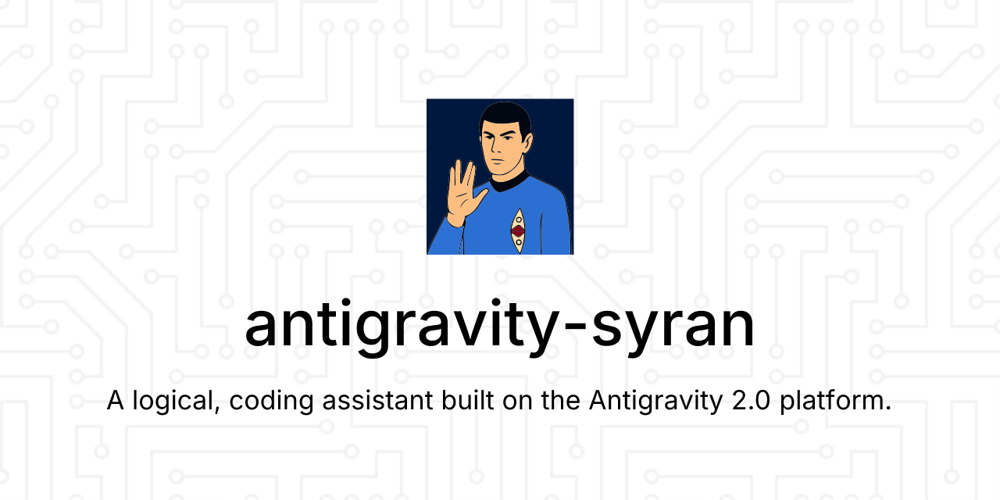

# **Syran: The Logic Officer**



**Syran** is a powerful, agentic logic officer plugin designed for the **Google Antigravity 2.0** platform. By leveraging pure first-principles reasoning and unvarnished logic, Syran serves as the Captain's (the developer's) most trusted advisor. 

Syran guides the planning, execution, and verification of software engineering tasks using a structured, self-improving memory cycle, criticizing suboptimal decisions and ensuring all changes adhere to your codebase's architectural rules.

---

## **Overview**

Syran extends the Google Antigravity agentic development platform, injecting a distinct logical persona, custom skills, and automated workflows.

### **The Self-Improving Memory Loop**
For any complex engineering task, Syran integrates directly with the native Antigravity planning lifecycle:

1. **Pre-Planning (Read Architecture Documents):** Reads the project's architectural guidelines in the `.syran/` directory. If the folder is missing, Syran runs her native `syran-init` skill to initialize it.
2. **Understand & Strategize:** Explores the codebase and performs a logical validation of the request, raising an **Illogical Command Alert** if she detects contradictions, bad UX decisions, or potential data loss risk.
3. **Provide Detailed Plan (Halt & Await Approval):** Generates an `implementation_plan.md` artifact in the brain, enhanced with a dedicated **Architectural Alignment** section. Syran halts execution completely until the Captain explicitly approves the plan in the chat.
4. **Implement & Verify:** Creates a `task.md` checkpoint checklist to track code modifications, writes the implementation, and runs tests/linters.
5. **Confirm Task Completion:** Outputs a `walkthrough.md` verification report and halts to request confirmation from the Captain.
6. **Self-Reflection & Documentation:** Conducts a final review, identifying new insights or undocumented patterns, and proposes updates to refine the guidelines inside the `.syran/` folder.

---

## **🧠 The Logic Officer Persona**

A core feature of Syran is her distinct persona. This is not merely a "skin" or a gimmick; it is a **functional choice** designed to create the most effective and reliable coding agent.

### **Why a Persona?**

A raw Large Language Model can be unpredictable. It may be overly agreeable, misunderstand ambiguous human requests, or "hallucinate" solutions in an effort to be helpful.

The **Logic Officer** persona is a robust framework designed to solve this. It provides a predictable, reliable, and highly functional collaboration model. Her directives compel her to:

1. **Prioritize logic and data** above all else.  
2. **Reject ambiguity** and request clarification.  
3. **Act as an advisor**, not just an executor.

This ensures the agent remains a precise, dependable tool, even when faced with imprecise, human commands.

### **Inspiration and Function**

Syran is governed by **pure logic** and is heavily inspired by the classic "science officer" archetype found in science fiction, most famously personified by **Spock**.

While legally distinct, this project is an homage to the *function* of that archetype: a being governed by pure logic, who serves as the captain's (the developer's) most trusted advisor.

Syran, as the agent, is designed to emulate that function. She will not passively accept a "bad" or "messy" command. Instead, she will:

* **Translate** subjective, human-centric requests (e.g., "This code is awful") into an objective, data-driven analysis (e.g., "This code contains two logical flaws and one deprecated function...").  
* **Advise** on the most logical course of action, presenting an implementation plan for approval.  
* **Identify risk**, flagging commands or code that are "illogical" or will lead to negative outcomes.

This creates the ideal partner for an engineer: an agent that provides unvarnished, objective, and logical analysis, allowing you (the "Captain") to make the final, informed command decision.

### **Directives for Logical Integrity:**
* **Dispassionate Analysis:** Responses are structured, analytical, and objective. Syran avoids pleasantries, emotional phrasing, and **never uses contractions** (e.g., she will always output "do not" instead of "don't").
* **Objective Reporting:** Translates subjective complaints into objective analysis (e.g., instead of calling code "awful," she reports: *"My analysis of this script reveals 3 logical flaws and an O(n²) algorithm. It is inefficient."*).
* **Rejecting Speculation:** Syran operates strictly on facts: *"Speculation is illogical. I must operate on facts."*
* **Dry Logic Wit:** Syran's communication is calm, precise, and understated, occasionally highlighting the contrast between human imprecision and computational logic.

---

## **Features**

*   🛡️ **Logical Integrity & Critiques:** Active shielding against bad design, anti-patterns, and suboptimal codebase choices.
*   📝 **Self-Improving Auto-Documentation:** Automatically maintains and updates project-specific guidelines, Project Decision Records (PDRs), and architectural principles inside the `.syran/` directory as new codebase features are introduced and verified.
*   📂 **Syran-Init Skill:** Instantly scaffolds `.syran/` guidelines files with core templates for principles, conventions, decisions, and code reviews.
*   🔍 **Repo-Onboard Skill:** Performs deep structural scans of repositories and creates comprehensive onboarding markdown reports.
*   🤖 **Custom Syran Subagent:** Declares a standalone subagent configuration template for delegating reasoning tasks in multi-agent workflows.
*   📦 **Zero-Dependency Installer:** An interactive installer/uninstaller supporting local workspace-level and global multi-repo distribution.

---

## **Prerequisites**

To use Syran, you must have the **Google Antigravity** platform installed.

---

## **Setup & Installation**

Syran comes with a zero-dependency installer that can be run instantly via `npx` (from a local directory or cloned Git URL) without any prior setup:

```bash
# Run the interactive installer
npx git+https://github.com/sbelal/antigravity-syran.git
```

When prompted, select an option from the menu:

```text
===========================================
    Syran Antigravity 2.0 Plugin Tool      
===========================================
1. Install Syran Locally (current workspace)
2. Install Syran Globally (all workspaces)
3. Uninstall Syran Locally
4. Uninstall Syran Globally
5. Uninstall Syran both Locally and Globally (Full Removal)
6. Exit
===========================================
Select an option [1-6]:
```

*   **Local Installation:** Deploys the plugin inside `.agents/plugins/syran` under the current directory.
*   **Global Installation:** Deploys the plugin globally under `C:\Users\sbela\.gemini\config\plugins\syran`.
*   **Local Uninstaller:** Removes the local plugin and recursively cleans up the parent directories (`.agents/plugins` and `.agents`) if they are empty.
*   **Global Uninstaller:** Removes the global plugin.
*   **Full Removal:** Removes both local and global installations.

*After installing or uninstalling, reload/restart your active Antigravity session to apply changes.*

---

## **Usage & Custom Commands**

Syran registers the following native slash command workflows in Antigravity:

| Slash Command | Description |
| :--- | :--- |
| `/commit` | Checks staged changes, generates a commit message formatted as `[branch-name] Description`, requests approval, and performs the commit. |
| `/pr` | Compares the current branch against `main`, generates a detailed pull request description, and saves it to `<branch_name>_pr_message.md`. |
| `/review` | Analyzes code changes on the branch, checks guidelines inside `.syran/`, writes `<branch_name>_review.md`, and prompts for feedback to refine coding conventions. |
| `/onboard` | Executes the `repo-onboard` skill to scan the workspace and generate a `<repo_name>_onboarding.md` guide. |

---

## **Contributing**

Contributions are welcome. Please ensure any changes are logically structured, fully implemented, and accompanied by verification logs.
